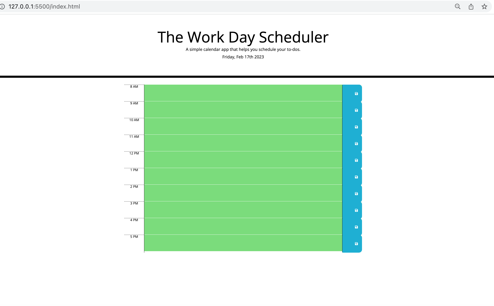

# Project Title
The Work Dar Schedualer
It is a simple calendar app that helps you schedule your to-dos.
 
## Description

It is showing the today's date
You can put your to dos
Click on save botton, and save your input
refresh the page, your save still remains

## Page URL
https://gitwholesale.github.io/the-work-day-scheduler/

### Executing program

Run the app with Vs code
check the date on the top of the page
If the page shows todays date, type your to dos

### Project Picture

### Author
Arash Saeedi 